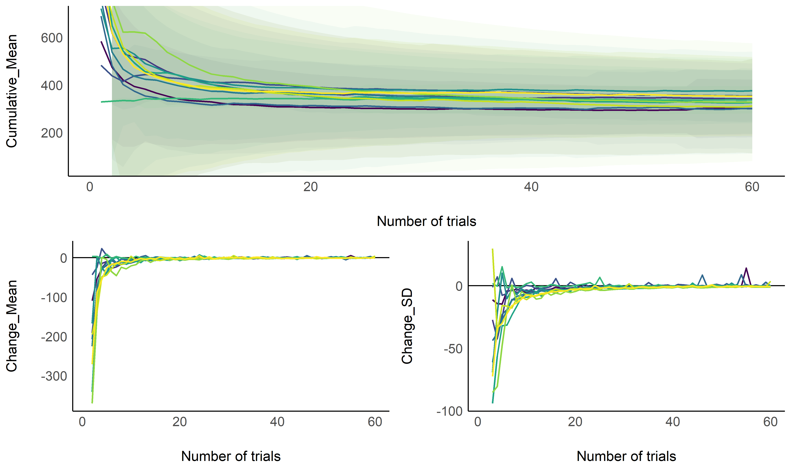
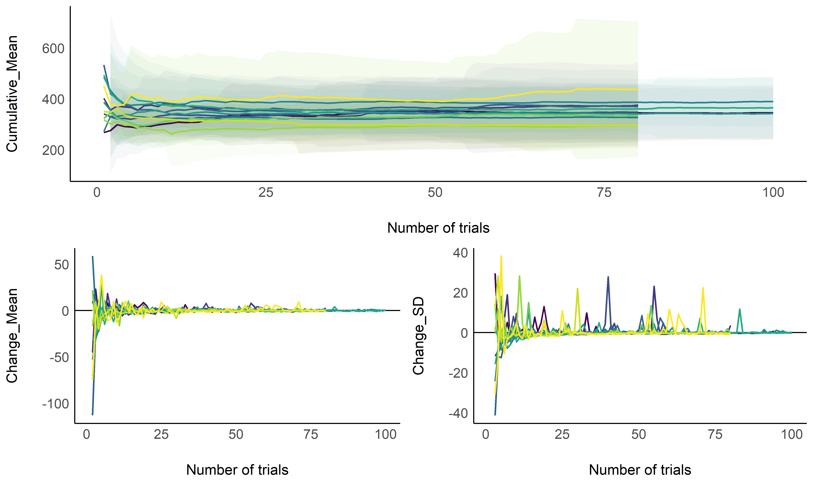
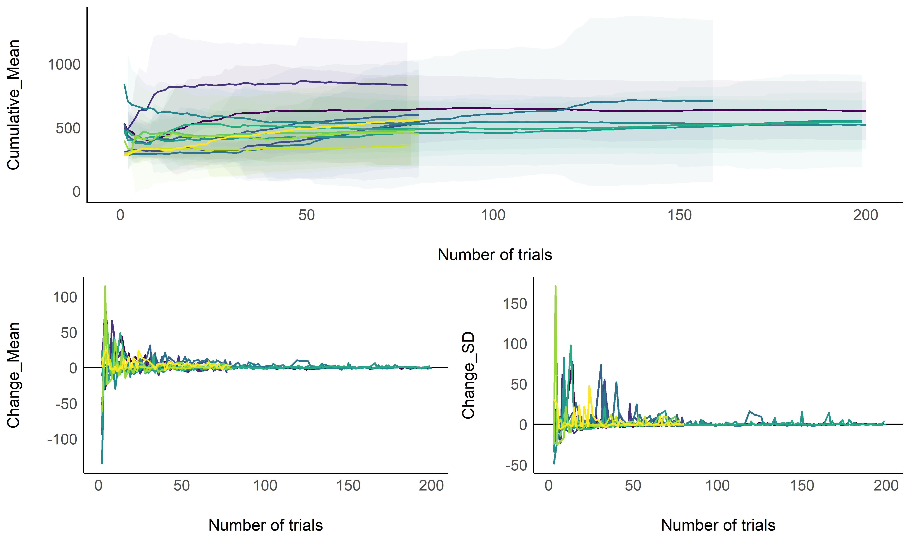
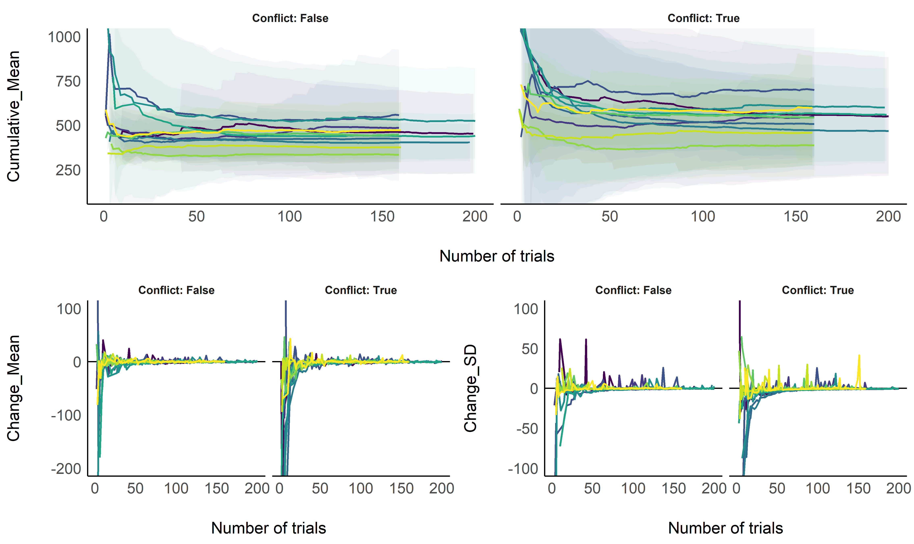
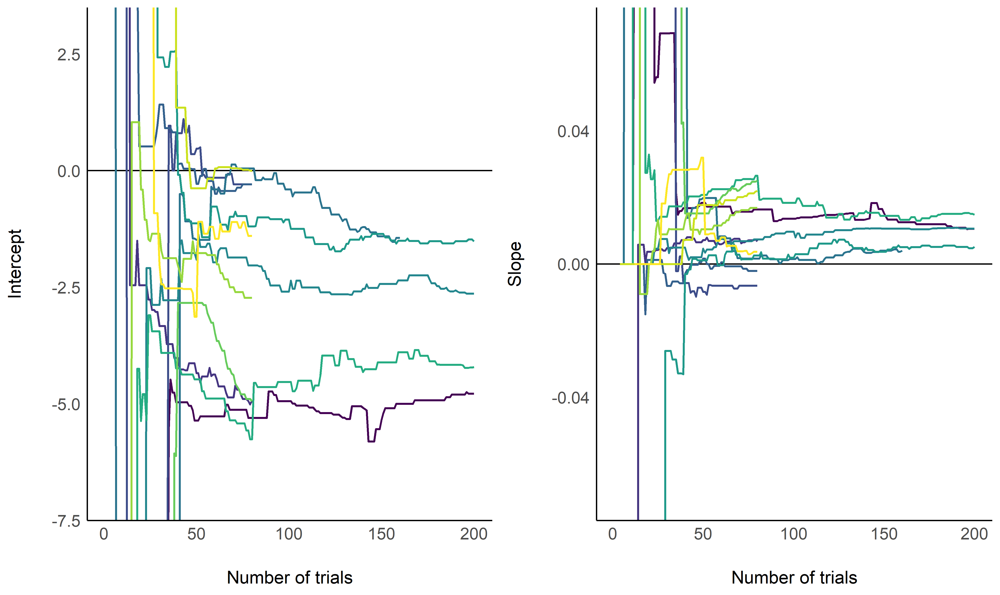
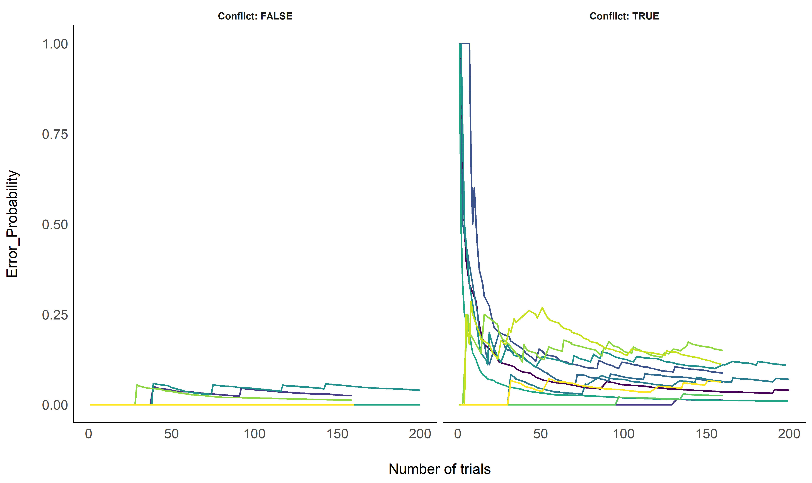

# What is the Optimal Number of Trials

The goal is to estimate what is the minimum of trials (so the task is as
short as possible) required to obtain stable estimates for a single
individual (different colors in the figures indicate different
participants).

<details>

<summary>Convenience functions (click to see the code)</summary>

<p>

``` r
library(tidyverse)
library(easystats)
## # Attaching packages
## <U+2714> insight     0.7.0        <U+2714> bayestestR  0.4.0.1   
## <U+2714> performance 0.4.0.1      <U+2714> parameters  0.2.5.1   
## <U+2714> see         0.2.1.9000   <U+2714> correlation 0.1.0     
## <U+2714> estimate    0.1.0        <U+2714> report      0.1.0
library(cowplot)

compute_cumulative <- function(data, fun = mean, col = "RT"){
  cumu <- c()
  for(i in 1:nrow(data)){
    cumu <- c(cumu,
              fun(data[1:i, col], na.rm = TRUE))
  }
  cumu
}

cumulative_data <- function(data){
  data$Cumulative_Mean <- compute_cumulative(data, fun = mean)
  data$Cumulative_SD <- compute_cumulative(data, fun = sd)
  data$Cumulative_CI_high <- data$Cumulative_Mean + data$Cumulative_SD * 1.96
  data$Cumulative_CI_low <- data$Cumulative_Mean - data$Cumulative_SD * 1.96

  data$Change_Mean <- c(NA, tail(data$Cumulative_Mean, -1) - head(data$Cumulative_Mean, -1))
  data$Change_SD <- c(NA, tail(data$Cumulative_SD, -1) - head(data$Cumulative_SD, -1))
  data[c("Participant", "Task", "Trial_Order",
         "Cumulative_Mean", "Cumulative_SD", "Cumulative_CI_high", "Cumulative_CI_low",
         "Change_Mean", "Change_SD")]
}


cumulative_errors <- function(data){
  data$Error <- as.character(data$Response) != as.character(data$Stimulus_Side)
  error_prob <- c()
  for(i in 1:nrow(data)){
    error_prob <- c(error_prob, sum(data$Error[1:i]) / i)
  }
  data$Error_Probability <- error_prob
  data[c("Participant", "Task", "Trial_Order", "Error_Probability")]
}


inhibition_model <- function(data){
  data$Error <- ifelse(as.character(data$Stop_Signal) %in% c("True", "TRUE") & data$Response %in% c("RIGHT", "LEFT"), TRUE, FALSE)
  glm(Error ~ Stop_Signal_RT, data = data, family = "binomial")
}


fix_old_subjects <- function(data){
  if("Stop_Signal" %in% names(data) && data$Participant %in% paste0("S", 5:13)){
    data <- data[!is.na(data$Trial_Order), ]
  }
  if("Stop_Signal" %in% names(data)){
    if(TRUE %in% data$Stop_Signal){ 
    data$Stop_Signal <- ifelse(data$Stop_Signal == TRUE, "True", "False")
    }
  }
  if(any(c("Conflict", "Congruence") %in% names(data))){
    if(!"Conflict" %in% names(data)){  
    data$Conflict <- ifelse(data$Congruence == "CONGRUENT", "False", "True")
    }
  }
  data
}
```

</p>

</details>

## Reaction Time

### Task 1: Simple Reaction Time

<details>

<summary>See code</summary>

<p>

``` r
df <- data.frame()
for(participant in list.files(path = "../data/pilot/")){
  if(!participant %in% c("S7")){
    for(path in list.files(path = paste0("../data/pilot/", participant), pattern = "*_ProcessingSpeed.csv", full.names = TRUE)){
      df <- rbind(df, cumulative_data(read.csv(path)))
    }
  }
}


fig1 <- cowplot::plot_grid(
  df %>%
    ggplot(aes(x = Trial_Order, y = Cumulative_Mean)) +
    # geom_vline(xintercept = 50, linetype = "dotted") +
    geom_ribbon(aes(ymin = Cumulative_CI_low, ymax = Cumulative_CI_high, fill = Participant), alpha = 0.05) +
    geom_line(aes(color = Participant), size = 1) +
    theme_modern() +
    scale_color_viridis_d(guide = FALSE) +
    scale_fill_viridis_d(guide = FALSE) +
    coord_cartesian(ylim = c(50, 700)) +
    xlab("Number of trials"),
  cowplot::plot_grid(df %>%
    ggplot(aes(x = Trial_Order, y = Change_Mean)) +
    # geom_vline(xintercept = 50, linetype = "dotted") +
    geom_hline(yintercept = 0) +
    geom_line(aes(color = Participant), size = 1) +
    theme_modern() +
    scale_color_viridis_d(guide = FALSE) +
    xlab("Number of trials"),
  df %>%
    ggplot(aes(x = Trial_Order, y = Change_SD)) +
    # geom_vline(xintercept = 50, linetype = "dotted") +
    geom_hline(yintercept = 0) +
    geom_line(aes(color = Participant), size = 1) +
    theme_modern() +
    scale_color_viridis_d(guide = FALSE) +
    xlab("Number of trials")),
  nrow = 2
)
```

</p>

</details>

<!-- -->

### Task 2: Response Selection

<details>

<summary>See code</summary>

<p>

``` r
df <- data.frame()
for(participant in list.files(path = "../data/pilot/")){
  for(path in list.files(path = paste0("../data/pilot/", participant), pattern = "*_ResponseSelection.csv", full.names = TRUE)){
    df <- rbind(df, cumulative_data(read.csv(path)))
  }
}

fig2 <- cowplot::plot_grid(
  df %>%
    ggplot(aes(x = Trial_Order, y = Cumulative_Mean)) +
    # geom_vline(xintercept = 60, linetype = "dotted") +
    geom_ribbon(aes(ymin = Cumulative_CI_low, ymax = Cumulative_CI_high, fill = Participant), alpha = 0.05) +
    geom_line(aes(color = Participant), size = 1) +
    theme_modern() +
    scale_color_viridis_d(guide = FALSE) +
    scale_fill_viridis_d(guide = FALSE) +
    xlab("Number of trials"),
  cowplot::plot_grid(df %>%
    ggplot(aes(x = Trial_Order, y = Change_Mean)) +
    # geom_vline(xintercept = 60, linetype = "dotted") +
    geom_hline(yintercept = 0) +
    geom_line(aes(color = Participant), size = 1) +
    theme_modern() +
    scale_color_viridis_d(guide = FALSE) +
    xlab("Number of trials"),
  df %>%
    ggplot(aes(x = Trial_Order, y = Change_SD)) +
    # geom_vline(xintercept = 60, linetype = "dotted") +
    geom_hline(yintercept = 0) +
    geom_line(aes(color = Participant), size = 1) +
    theme_modern() +
    scale_color_viridis_d(guide = FALSE) +
    xlab("Number of trials")),
  nrow = 2
)
```

</p>

</details>

<!-- -->

### Task 3: Response Inhibition

<details>

<summary>See code</summary>

<p>

``` r
df <- data.frame()
for(participant in list.files(path = "../data/pilot/")){
  for(path in list.files(path = paste0("../data/pilot/", participant), pattern = "*_ResponseInhibition.csv", full.names = TRUE)){
    dat <- fix_old_subjects(read.csv(path))
    df <- rbind(df, cumulative_data(dat[dat$Stop_Signal == "False", ]))
  }
}

fig3 <- cowplot::plot_grid(
  df %>%
    ggplot(aes(x = Trial_Order, y = Cumulative_Mean)) +
    # geom_vline(xintercept = 60, linetype = "dotted") +
    geom_ribbon(aes(ymin = Cumulative_CI_low, ymax = Cumulative_CI_high, fill = Participant), alpha = 0.05) +
    geom_line(aes(color = Participant), size = 1) +
    theme_modern() +
    scale_color_viridis_d(guide = FALSE) +
    scale_fill_viridis_d(guide = FALSE) +
    xlab("Number of trials"),
  cowplot::plot_grid(df %>%
    ggplot(aes(x = Trial_Order, y = Change_Mean)) +
    # geom_vline(xintercept = 60, linetype = "dotted") +
    geom_hline(yintercept = 0) +
    geom_line(aes(color = Participant), size = 1) +
    theme_modern() +
    scale_color_viridis_d(guide = FALSE) +
    xlab("Number of trials"),
  df %>%
    ggplot(aes(x = Trial_Order, y = Change_SD)) +
    # geom_vline(xintercept = 60, linetype = "dotted") +
    geom_hline(yintercept = 0) +
    geom_line(aes(color = Participant), size = 1) +
    theme_modern() +
    scale_color_viridis_d(guide = FALSE) +
    xlab("Number of trials")),
  nrow = 2
)
```

</p>

</details>

<!-- -->

### Task 4: Conflict Resolution

<details>

<summary>See code</summary>

<p>

``` r
df <- data.frame()
for(participant in list.files(path = "../data/pilot/")){
  for(path in list.files(path = paste0("../data/pilot/", participant), pattern = "*_ConflictResolution.csv", full.names = TRUE)){
    if(!participant %in% c("S11")){
      dat <- fix_old_subjects(read.csv(path))
      cong <- cumulative_data(dat[dat$Conflict == "False", ])
      cong$Conflict <- "False"
      incong <- cumulative_data(dat[dat$Conflict == "True", ])
      incong$Conflict <- "True"
      df <- rbind(df, rbind(cong, incong))
    }
  }
}

fig4 <- cowplot::plot_grid(
  df %>%
    ggplot(aes(x = Trial_Order, y = Cumulative_Mean)) +
    # geom_vline(xintercept = 120, linetype = "dotted") +
    geom_ribbon(aes(ymin = Cumulative_CI_low, ymax = Cumulative_CI_high, fill = Participant), alpha = 0.05) +
    geom_line(aes(color = Participant), size = 1) +
    theme_modern() +
    scale_color_viridis_d(guide = FALSE) +
    scale_fill_viridis_d(guide = FALSE) +
    facet_grid(~Conflict, labeller = "label_both") +
    coord_cartesian(ylim = c(100, 1000)) +
    xlab("Number of trials"),
  cowplot::plot_grid(df %>%
    ggplot(aes(x = Trial_Order, y = Change_Mean)) +
    # geom_vline(xintercept = 120, linetype = "dotted") +
    geom_hline(yintercept = 0) +
    geom_line(aes(color = Participant), size = 1) +
    theme_modern() +
    scale_color_viridis_d(guide = FALSE) +
    facet_grid(~Conflict, labeller = "label_both") +
    coord_cartesian(ylim = c(-200, 100)) +
    xlab("Number of trials"),
  df %>%
    ggplot(aes(x = Trial_Order, y = Change_SD)) +
    # geom_vline(xintercept = 120, linetype = "dotted") +
    geom_hline(yintercept = 0) +
    geom_line(aes(color = Participant), size = 1) +
    theme_modern() +
    scale_color_viridis_d(guide = FALSE) +
    facet_grid(~Conflict, labeller = "label_both") +
    coord_cartesian(ylim = c(-100, 100)) +
    xlab("Number of trials")),
  nrow = 2
)
```

</p>

</details>

<!-- -->

## Errors

<!-- ### Task 2: Response Selection -->

<!-- <details><summary>See code</summary> -->

<!-- <p> -->

<!-- ```{r, echo = TRUE, warning=FALSE, message=FALSE} -->

<!-- df <- data.frame() -->

<!-- for(path in list.files(path = "data/", pattern = "*_ResponseSelection.csv", full.names = TRUE)){ -->

<!--   df <- rbind(df, cumulative_errors(read.csv(path))) -->

<!-- } -->

<!-- fig4 <- df %>% -->

<!--     ggplot(aes(x = Trial_Order, y = Error_Probability)) + -->

<!--     geom_vline(xintercept = 60, linetype = "dotted") + -->

<!--     geom_line(aes(color = Participant), size = 1) + -->

<!--     theme_modern() + -->

<!--     scale_color_viridis_d(guide = FALSE) + -->

<!--     scale_fill_viridis_d(guide = FALSE) -->

<!-- ``` -->

<!-- </p> -->

<!-- </details> -->

<!-- ```{r, echo = FALSE, warning=FALSE, message=FALSE} -->

<!-- fig4 -->

<!-- ``` -->

### Task 3: Response Inhibition

<details>

<summary>See code</summary>

<p>

``` r
df <- data.frame()
for(participant in list.files(path = "../data/pilot/")){
  for(path in list.files(path = paste0("../data/pilot/", participant), pattern = "*_ResponseInhibition.csv", full.names = TRUE)){
    data <- fix_old_subjects(read.csv(path))
    predicted <- estimate::estimate_link(inhibition_model(data))
    predicted$Participant <- unique(data$Participant)
    df <- rbind(df, predicted)
  }
}


fig5 <- df %>%
  ggplot(aes(x = Stop_Signal_RT, y = Predicted)) +
  geom_ribbon(aes(ymin = CI_low, ymax = CI_high, fill = Participant), alpha = 0.1) +
  geom_line(aes(color = Participant), size = 1) +
  theme_modern() +
  scale_color_viridis_d(guide = FALSE) +
  scale_fill_viridis_d(guide = FALSE)  +
  xlab("Stop Signal RT (SSRT)") +
  ylab("Probability of Inhibition Failure") +
  coord_cartesian(ylim = c(0, 1)) 
```

</p>

</details>

<!-- -->

<details>

<summary>See code</summary>

<p>

``` r
df <- data.frame()
for(participant in list.files(path = "../data/pilot/")){
  for(path in list.files(path = paste0("../data/pilot/", participant), pattern = "*_ResponseInhibition.csv", full.names = TRUE)){
    data <- fix_old_subjects(read.csv(path))
    for(i in 1:nrow(data)){
      dat <- tryCatch({
          model <- inhibition_model(data[1:i, ])
          params <- insight::get_parameters(model)$Estimate
          se <- standard_error(model)
          data.frame(Intercept = params[1],
                     Intercept_CI_high = params[1] + se$SE[1] * 1.96,
                     Intercept_CI_low = params[1] - se$SE[1] * 1.96,
                     Slope = params[2],
                     Slope_CI_high = params[2] + se$SE[2] * 1.96,
                     Slope_CI_low = params[2] - se$SE[2] * 1.96)
      }, error = function(e) {
          data.frame(Intercept = NA,
                     Intercept_CI_high = NA,
                     Intercept_CI_low = NA,
                     Slope = NA,
                     Slope_CI_high = NA,
                     Slope_CI_low = NA)
      })
      
      dat$Participant <- unique(data$Participant)
      dat$Trial_Order <- i
      df <- rbind(df, dat)
    }
  }
}


fig6 <- cowplot::plot_grid(
  df %>%
    ggplot(aes(x = Trial_Order, y = Intercept)) +
    geom_hline(yintercept = 0) +
    # geom_ribbon(aes(ymin = Intercept_CI_low, ymax = Intercept_CI_high, fill = Participant), alpha = 0.1) +
    geom_line(aes(color = Participant), size = 1) +
    theme_modern() +
    scale_color_viridis_d(guide = FALSE) +
    scale_fill_viridis_d(guide = FALSE) +
    coord_cartesian(ylim = c(-7, 3)) +
    xlab("Number of trials"),
  df %>%
    ggplot(aes(x = Trial_Order, y = Slope)) +
    geom_hline(yintercept = 0) +
    # geom_ribbon(aes(ymin = Intercept_CI_low, ymax = Slope_CI_high, fill = Participant), alpha = 0.1) +
    geom_line(aes(color = Participant), size = 1) +
    theme_modern() +
    scale_color_viridis_d(guide = FALSE) +
    scale_fill_viridis_d(guide = FALSE) +
    coord_cartesian(ylim = c(-0.07, 0.07)) +
    xlab("Number of trials")
)
```

</p>

</details>

<!-- -->

### Task 4: Conflict Resolution

<details>

<summary>See code</summary>

<p>

``` r
df <- data.frame()
for(participant in list.files(path = "../data/pilot/")){
  if(!participant %in% c("S11")){
    for(path in list.files(path = paste0("../data/pilot/", participant), pattern = "*_ConflictResolution.csv", full.names = TRUE)){
      dat <- fix_old_subjects(read.csv(path))
      cong <- cumulative_errors(dat[dat$Conflict == "False", ])
      cong$Conflict <- FALSE
      incong <- cumulative_errors(dat[dat$Conflict == "True", ])
      incong$Conflict <- TRUE
      df <- rbind(df, rbind(cong, incong))
    }
  }
}

fig7 <- df %>%
    ggplot(aes(x = Trial_Order, y = Error_Probability)) +
    # geom_vline(xintercept = 120, linetype = "dotted") +
    geom_line(aes(color = Participant), size = 1) +
    theme_modern() +
    scale_color_viridis_d(guide = FALSE) +
    scale_fill_viridis_d(guide = FALSE) +
    facet_grid(~Conflict, labeller = "label_both") +
    xlab("Number of trials")
```

</p>

</details>

<!-- -->
